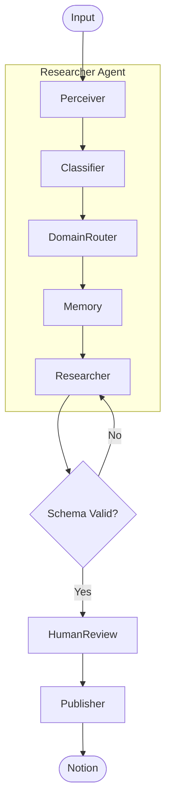

# 💠 AI Knowledge Agent (LangGraph Edition)

> A production-oriented AI agent that **turns raw information into structured, reviewable, and evolving Notion knowledge**, powered by LangGraph.


## 🧠 Core Ideas

### 1. Knowledge is a workflow, not a prompt
Most AI note tools rely on a single prompt → single output.
This system models knowledge creation as a **StateGraph**:

- perception
- intent classification
- semantic routing
- memory recall
- generation
- validation
- human review
- publishing

Each step is explicit, inspectable, and debuggable.

---

### 2. LangGraph as a control plane
LangGraph is used not as a “chain builder”, but as a **control plane**:

- explicit state transitions
- retry loops on failure
- conditional branching
- interruptible execution (Human-in-the-loop)

LLMs generate content — **the graph decides what happens next**.

---

### 3. Human-in-the-loop is governance, not a patch
Before anything is written to Notion, execution is paused.

The human reviewer can:
- edit the content
- approve or reject
- override the semantic category (KnowledgeDomain)

This turns the agent from an autonomous risk into a **governed system**.

---

## ✨ Key Features

| Feature | Description |
|------|-------------|
| 🔁 Self-correction loop | If generated content fails schema validation, the graph automatically retries with error context. |
| ✋ Human-in-the-loop (HITL) | Uses LangGraph `interrupt_before` to pause execution before publishing. |
| 🧠 Long-term memory | Single vector database (ChromaDB) with domain metadata for semantic recall and future reranking. |
| 🧭 Semantic routing | KnowledgeDomain is inferred first, then mapped to the target Notion database by the graph. |
| 🌍 Multimodal input | Supports plain text, PDFs, URLs, and YouTube videos. |
| ✍️ Deterministic publishing | Editor Agent only executes writes — it never decides *where* to write. |

---

## 🏗️ System Architecture



---

## 🧭 Design Principles

- **Explicit over implicit**  
  Decisions (domain, database, retry) live in the graph, not hidden inside prompts.

- **LLM as a component, not the system**  
  The agent works *around* the model, not *inside* it.

- **Failure is expected**  
  Validation and retries are first-class citizens.

- **Memory should grow, not fragment**  
  A single vector store with domain metadata preserves semantic continuity.

---

## 📂 Project Structure

```
notion-ai-agent/
├── app.py            # Streamlit UI + Human Review
├── graph_agent.py    # LangGraph workflow definition
├── agents.py         # Researcher / Editor agents
├── notion_ops.py     # Notion API execution layer
├── vector_ops.py     # ChromaDB memory
├── web_ops.py        # Web & video ingestion
├── llm_client.py     # Model abstraction
└── README.md
```

---

## 🧪 Status

This project is **actively evolving**.
It is already usable for real personal knowledge workflows, but still experimental in:

- ranking / merging strategies
- long-horizon memory management
- cross-domain synthesis

---

